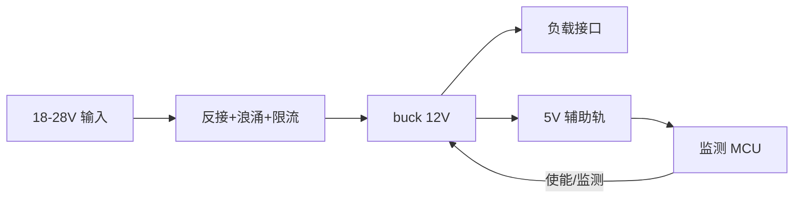

# Design Baseline: 无人机负载电源板（合成示例）

> 本文是格式演示用的虚构板卡：所有 MPN 与数值均为占位，不得作为真实工程参数。
> 分类：事实=有出处；假设=AI 推断并带依据；待确认=`[XXX]`。

> 状态摘要
> - 已确认：需求基线、电源树骨架、两路接口
> - 待确认：负载峰值电流、认证要求、供应商锁定
> - 下一轮问题队列：① 各负载峰值/均值电流 ② 是否需 EN62368 ③ 连接器线序锁定

## 1 需求基线

| ID | 内容 | 来源 | 分类 |
|---|---|---|---|
| REQ-1 | 输入 18–28V，输出 12V/3A 供下游负载 | 对话轮1 | 事实 |
| REQ-2 | 反接保护，不得损坏上游设备 | 对话轮1 | 事实 |
| REQ-3 | 输入浪涌与过流保护 | 平台指南 §4 | 假设（沿用同类板做法，待确认） |
| REQ-4 | 防护等级 IP5X | [XXX] | 待确认 |

## 2 架构

- 信号流：输入保护 → 主降压 → 负载；辅助轨只供监测 MCU，不共主轨。
- 电源/地策略：功率地与信号地单点汇接于输入侧（假设，理由：抑制共模噪声，待定）。

## 3 电源树

| 轨 | 来源 | 电压 | 额定 | 负载与电流 | 合计裕量 | 时序 | 依据 |
|---|---|---|---|---|---|---|---|
| V12V0 | U1 buck | 12V | 4.0A | 负载 3.0A | 25% | 第 1 | 对话轮1（3A），额定为假设 |
| V5V0 | U2 buck | 5V | 1.0A | MCU 0.3A + 预留 0.2A | 50% | 第 2 | MCU datasheet [XXX] |

## 4 外设与接口分配

| 接口 | 协议/电平 | 主控引脚/资源 | 方向 | 冲突与约束 |
|---|---|---|---|---|
| 负载电源输出 | 12V/3A | XT30 | 出 | 与编程口共用防呆需确认 |
| 调试 | UART 3.3V | MCU PA9/PA10 | 双向 | 不与 I2C 复用 |

## 5 关键器件选型

| 位号/功能 | MPN | 关键参数 | datasheet 出处 | 降额结论 | 替代料 |
|---|---|---|---|---|---|
| U1 主降压 | [XXX] | 输入 ≥28V、输出 12V/4A | [XXX] | [XXX] | [XXX] |
| D1 反接 | 示例 P-MOS | -30V/-10A | 示例 datasheet | 假设：电压 1.5×、电流 2× | [XXX] |

## 6 功能方案与关键链路

- 保护链：输入 → 反接 MOS → 浪涌 → 限流 → buck，逐跳已走通。
- 失效安全：MCU 失电时 buck EN 默认关断（假设，依赖 U1 默认态，待核对 datasheet）。

## 7 风险与开放问题

- `[XXX]` 负载峰值电流：决定 U1 额定与热预算，索取对象=结构/整机。
- `[XXX]` 认证与供应商锁定：影响保护器件选型，索取对象=项目经理。
